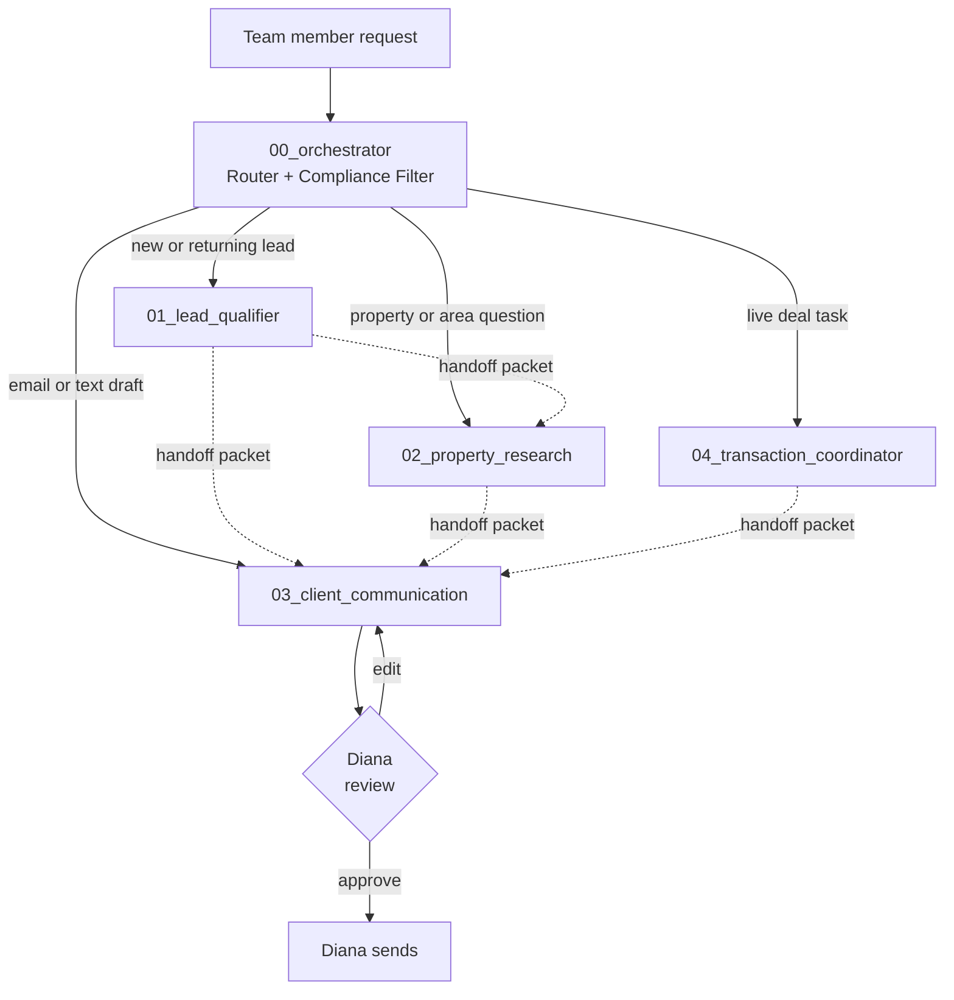

# The Agency

An AI operating system for Diana's 4-person boutique real estate team in Austin.

This is not software. It is a folder of plain-English instructions that a real estate team drops into an AI workspace (Claude, ChatGPT, or Gemini), then uses by typing requests in everyday language. Five specialists, one front door, clear handoffs at every step, human review before anything leaves the system.

## Use This Today

If this folder is already installed in your AI project, and you only use ChatGPT and do not want to think about folders:

1. Open the Agency project.
2. Start a new chat.
3. Paste the real lead, property question, draft request, or transaction update.

The first thing to type can be as simple as:

```text
Use The Agency. Help me with this:

[paste the real client note, lead text, property question, or deal update]
```

The assistant should route the request, flag anything risky, and give you the next draft or next question. You do not need to open specialist folders during normal use. The folders are there so the AI has rules to follow.

## 5-Minute Setup (do this once)

1. Open [Claude.ai](https://claude.ai), [ChatGPT](https://chat.openai.com), or [Gemini](https://gemini.google.com) in your browser.
2. Create a new project (Claude calls it "Projects," ChatGPT calls it "Custom GPT" or "Projects," Gemini calls it a "Gem").
3. **Drag this entire folder** into the project's knowledge or files area.
4. Start a new chat in the project.
5. Type: `start onboarding`
6. Answer the 5 questions one at a time as they appear.
7. When the assistant gives you a `profile.md` file, save it into `_user_data/`. That private file is ignored by Git. The assistant tells you exactly when.

That's it. From now on, just open the project and type what you need.

You are ready when the assistant stops asking for onboarding and can help you draft a test lead. You only touch files during setup or when updating team preferences later.

For a worked example of what a completed profile looks like, see [`_user_data/profile.example.md`](_user_data/profile.example.md). For the blank shape, see [`_user_data/profile.template.md`](_user_data/profile.template.md).

## Your First Lead (2-minute walkthrough)

Once setup is done, here is what using the system looks like for ONE real lead, start to finish:

**1. You type:**

> Got a buyer text from Mike: "My friend Alex is moving to Austin in October, looking under $750K, East Austin, pre-approved. Please reach out."

**2. System routes and produces:**

- Lead summary: warm referral, missing Alex's contact info, missing buyer rep agreement status, missing language preference.
- Compliance flag: post-NAR August 2024 requires Alex to sign a buyer rep agreement BEFORE any showing. The system will not propose tour scheduling without it.
- Two drafts: a reply to Mike asking for Alex's contact info, and a follow-up message to Alex once you have it. Both in Diana's voice.

**3. You do:**

- Review the drafts. Voice score is on each one (out of 20).
- Send the Mike reply yourself (the system never sends).
- Hand the Alex-side draft to Diana for review before she sends.
- Ask: `Create or update the matter log for this lead. Give me exactly what to save and what to paste into my CRM notes.`

That is the loop. About 2 minutes from typing the lead to having two ready-to-review drafts. Type whatever you need next, property research, transaction update, mid-deal client message, and the orchestrator routes it the same way.

## Where Everything Goes

- **Chat:** working space. Use it to ask, draft, route, and revise.
- **Matter log:** AI memory snapshot. Save one markdown file per lead or deal in your private `_matters/` folder, or paste the same content into your private CRM/deal notes.
- **CRM or transaction system:** official record. Lead status, signed agreements, deadlines, decisions, and client communication history live there.
- **Email or text app:** final send location. The system drafts only, a human sends.

The AI does not remember old chats unless you paste the matter log back in. Matter logs are markdown files, not a database. A database may make sense in a future software version, but v1 stays lightweight so a realtor can run it without setup.

## Every-Day Use

Open the project. Start a new chat. Type what you need in plain English:

- "I have a new lead, can you help me qualify them?"
- "Tell me about 1234 Main St in 78704"
- "Draft a follow-up email to a buyer who hasn't responded in a week"
- "I just got an executed contract, what do I need to track?"

The orchestrator routes your question to the right specialist automatically. You never have to know which folder does what.

If something feels off (the AI made something up, it asked too many questions, it refused to answer, the voice doesn't sound right), ask the orchestrator to recover and name the issue. New to real estate jargon, or not sure what an unlicensed assistant can do? The optional support references are in `reference/`.

## Stuck?

Use one of these recovery prompts:

- `I'm stuck. What's the cleanest next step?`
- `Wrong route. Re-route this and explain why.`
- `Draft now using what we have, and mark any gaps.`
- `The voice is off. Make it warmer, shorter, and more like Diana.`
- `Check this packet before I rely on it.`

The system is a workflow, not a sender. You still review everything before it goes to a client.

## Power User Fast Path

If you already use Claude or ChatGPT for MLS exports, CRM notes, transaction docs, and client emails, paste dense context and ask for the exact output you need.

**Lead intake**

```text
Use The Agency. Start with the orchestrator, then qualify this lead.

Lead/source notes:
[paste portal lead, referral note, CRM note, or call recap]

Return: lead summary, missing blockers, buyer-rep/listing-agreement status, compliance flags, and next client draft if safe.
```

**Property research**

```text
Use The Agency. Start with the orchestrator, then property research.

MLS/export/source notes:
[paste listing facts, MLS notes, county info, showing notes, or source links]

Return: source-backed facts only, stale or missing data, what cannot be claimed, and a communication handoff if a client reply is needed.
```

**Transaction status**

```text
Use The Agency. Start with the orchestrator, then transaction coordinator.

Deal status:
[paste executed-date notes, option period, financing, appraisal, title, inspection, or closing updates]

Return: verified deadline checklist, blockers, escalation owner, client-safe update draft request, and what not to say yet.
```

For multi-chat work, keep a simple matter log using [`reference/matter-log-template.md`](reference/matter-log-template.md). Save private logs as `_matters/YYYY-MM-DD-client-or-address.md` or paste the same content into your CRM/deal file. For copied MLS, CRM, deadline, and draft inputs, use [`reference/import-export-templates.md`](reference/import-export-templates.md). Before relying on an output, ask the assistant to run the [`reference/packet-validation-checklist.md`](reference/packet-validation-checklist.md).

## Routing Diagram



Every request enters at the orchestrator. The orchestrator routes, flags compliance risk, and creates the first handoff packet. Specialists do one job each. Drafts never reach a client without human review.

## Specialists

| Folder | Specialist | When it activates |
|---|---|---|
| `00_orchestrator/` | Router + compliance filter | Every message comes in here first |
| `01_lead_qualifier/` | First-contact intake | Someone reaches out about buying, selling, renting, or investing |
| `02_property_research/` | Property and market research | Need info on a specific address or area |
| `03_client_communication/` | Email and text drafts | Need to send something to a client |
| `04_transaction_coordinator/` | Live deal management | A contract is executed |

Each specialist has four files: `identity.md`, `rules.md`, `examples.md`, `handoff.md`. Some specialists also have a `reference/` subfolder with deeper playbooks, and some have a `modes/` subfolder with scripted intake flows.

## Typical Flow

A real example, end to end:

1. **Diana's assistant types:** "Just got a Zillow inquiry on the Bouldin listing, Alex Chen, looking 60 days out, pre-approved up to $750k."
2. **Orchestrator** sees "new inquiry" and routes to `01_lead_qualifier`, flags fair-housing risk as low, source reliability as medium.
3. **Lead qualifier** runs intake, captures intent, budget, timeline, returns a clean lead summary plus a handoff packet.
4. **Lead qualifier hands off** to `03_client_communication` with: "Warm lead, 60 days, send first-reply email in Diana's voice."
5. **Client communication** drafts the email using Diana's voice profile.
6. **Diana reviews, edits, sends.**
7. **Two weeks later** Alex signs a buyer rep. Diana types: "We're going to tour 1234 Main St Saturday."
8. **Orchestrator** routes to `02_property_research`.
9. **Property research** pulls comps, schools, permit history from approved sources, returns a tour briefing with source confidence labels.
10. **Alex's offer is accepted.** Diana types: "Alex's contract executed today, $735k, 30-day close."
11. **Orchestrator** routes to `04_transaction_coordinator`.
12. **Transaction coordinator** sets up the Texas timeline (option period, financing, appraisal, close), tracks deadlines, drafts vendor outreach when needed, hands client updates back to `03_client_communication`.

At every step the team sees the answer in chat. They never have to navigate folders or know which specialist did what.

| Common flow | Sequence |
|---|---|
| New buyer lead | `00_orchestrator` → `01_lead_qualifier` → `03_client_communication` |
| Buyer asks about a house | `00_orchestrator` → `02_property_research` → `03_client_communication` |
| Seller listing prep | `00_orchestrator` → `01_lead_qualifier` → `02_property_research` → `03_client_communication` |
| Offer accepted | `00_orchestrator` → `04_transaction_coordinator` → `03_client_communication` |
| Mixed request | `00_orchestrator` splits it into sequenced handoffs |

## The Handoff Packet

Every folder passes work using the same packet shape:

```md
## Handoff Packet

From:
To:
Matter ID:
Stage:
Client or lead:
Matter:
Urgency:
Current status:

## Known Facts
-

## Missing Information
- Blocking:
- Helpful:
- Can wait:

## Compliance Flags
- Fair housing:
- Advertising or broker-review:
- Legal, tax, lending, or inspection advice:
- Privacy or sensitive data:

## Source And Proof State
- Source of truth:
- Source checked at:
- Needs recheck before:
- Proof available:
- Proof missing:

## Requested Output

## Next Owner

## Human Review
- Reviewer needed:
- Review reason:
- Cannot proceed until:

## Human Review Needed Before
- sending to a client
- changing a deadline
- relying on a source
- adding to a live transaction file
```

The packet is the grading center of this system. Every handoff includes Matter ID, Stage, Blocking-missing-info, Source-of-truth, and a Human-Review gate. If a packet lacks any of these, the receiving specialist asks for them before starting work.

## Voice Setup

Before relying on client-facing drafts, run `setup/voice-onboarding.md`. The process asks Diana for redacted writing samples and scenario answers, then writes `03_client_communication/reference/agent-voice.md`.

A **synthetic mock Diana voice** ships in that file already so the demo loop works on day one. Replace it with the real Diana voice profile before live client use.

## Onboarding A New Team Member

1. Read this README.
2. Read `00_orchestrator/identity.md` and `00_orchestrator/rules.md`.
3. Practice with the examples in each specialist folder.
4. Use the handoff packet exactly until the pattern becomes natural.
5. Never send client-facing output without Diana or the assigned agent reviewing it.

## Operating Principles

- One folder, one job.
- Plain language beats clever language.
- Source-backed facts only.
- Do not steer clients based on protected classes.
- Do not scrape listing sites or bypass access controls.
- Do not give legal, tax, lending, inspection, or appraisal advice.
- Every public-facing advertisement or marketing claim needs broker review.
- Every client-facing message is a draft until a human approves it.
- Wire instructions are verified by phone with title, never trusted by email. The system never relays them.
- Buyer's agents must have a signed representation agreement before showing any home (post-NAR August 2024 settlement).
- The system drafts in English only; non-English leads are surfaced for bilingual handoff.

## What To Customize

Before using this with Diana's real team, update:

- Team roles, approval powers, source systems, and escalation owners in `setup/team-onboarding.md`.
- First-contact scripts and lead-source rules in `01_lead_qualifier/reference/first-contact-playbook.md`.
- Research handoff examples and local source behavior in `02_property_research/reference/research-handoff-examples.md`.
- Human-writing baseline in `03_client_communication/reference/human-writing-baseline.md`.
- Ethical sales-psychology baseline in `03_client_communication/reference/sales-psychology-baseline.md`.
- Diana's voice profile in `03_client_communication/reference/agent-voice.md` (currently a synthetic mock).
- Team names in `04_transaction_coordinator/rules.md`.
- Approved data sources in `02_property_research/reference/research-sources.md`.
- Texas TREC checklist localizations in `04_transaction_coordinator/reference/texas-trec-checklist.md`.
- Any brokerage-specific compliance requirements.
- Local MLS, title company, lender, inspector, and transaction-management conventions.

## Submission

### 100-Word Summary

The Agency is a folder-based AI operating system for Diana's 4-person Austin real estate team. It turns one messy client request into a routed workflow across five specialists: orchestrator, lead qualifier, property research, client communication, and transaction coordinator. The key design decision is putting compliance in the orchestrator, not only inside the specialist folders, so fair-housing, advertising, source, deadline, and advice risks are flagged before work moves downstream. With another week, I would add city-specific source packs and run more mock handoff tests so Diana's team can safely adapt it to their brokerage workflow.

### What I Built

A teachable, multi-folder real estate team workflow that runs inside any AI project without custom software. Five specialists, a shared handoff packet schema, a compliance-first orchestrator, and reference playbooks deep enough for an Austin-area team to use day one.

### One Design Decision

The orchestrator is both the router and the first compliance screen. That matters because real estate mistakes often happen before writing starts: the wrong owner, missing source, stale status, fair-housing-sensitive wording, or unverified deadline. By flagging compliance first, the system protects the team before a specialist ever produces text that could hurt a client.

### If I Had Another Week

Austin-specific source packs, more transaction checklist templates, a Spanish-language parallel for the Austin market, and a scored mock test report showing handoff quality before live team use.

Optional reviewer evidence and deeper references live in [`reference/`](reference/). They are not required for first use.

---

## Backup Direct Prompts

If you prefer to paste prompts manually instead of using the drag-and-drop setup above, use these. Skip this section if you ran "start onboarding" above.

### Orchestrator Routing Prompt

```text
Use The Agency operating system.

Start in `00_orchestrator/`.
Read `README.md`, then read `00_orchestrator/identity.md`, `00_orchestrator/rules.md`, `00_orchestrator/examples.md`, and `00_orchestrator/handoff.md`.

Route this request, flag risks, and create the first handoff packet:

[paste lead note, client message, property question, or transaction update]
```

The AI should:

1. Decide which specialist owns the next step.
2. Create a handoff packet.
3. Tell you which specialist owns the next step.
4. Tell you what not to do yet.

### Specialist Continuation Prompt

```text
Use `01_lead_qualifier/`.
Read its `identity.md`, `rules.md`, `examples.md`, `handoff.md`, and `reference/first-contact-playbook.md`.

Use this handoff packet to qualify the lead and prepare the next reply:

[paste handoff packet]
```

### Common First Prompts

**New Buyer Lead**

```text
Use The Agency. Start in `00_orchestrator/`.

New lead:
"Hi, I am moving to Austin this summer. Looking under 800k, maybe East Austin. I work downtown and want something with character."

Route it, qualify what we know, identify missing info, and prepare the next handoff.
```

**Portal-Style Property Inquiry**

```text
Use The Agency. Start in `00_orchestrator/`.

Lead asks:
"Is 4812 Sample Bend still available? We could see it this weekend."

Route this. Do not promise availability. Tell me what needs verification before a client reply.
```

**Neighborhood Or Safety Question**

```text
Use The Agency. Start in `00_orchestrator/`.

Client asks:
"Is this area safe and good for families?"

Route this and produce the compliant next step. Do not make fair-housing-sensitive claims.
```

**Accepted Offer**

```text
Use The Agency. Start in `00_orchestrator/`.

Offer accepted. Note says option period ends Friday at 5 PM. Inspection is tomorrow. Executed contract is not attached.

Route this and tell me what can and cannot be said until dates are verified.
```

### Manual Setup Prompt

```text
Use The Agency setup docs.

Read `setup/team-onboarding.md` and `setup/voice-onboarding.md`.
Interview me one section at a time. Ask only the questions needed to create:

1. Team roles and approval owners
2. Lead-source rules
3. Research-source rules
4. Escalation matrix
5. Diana's voice profile

At the end, summarize what should be written into the relevant reference files.
```
